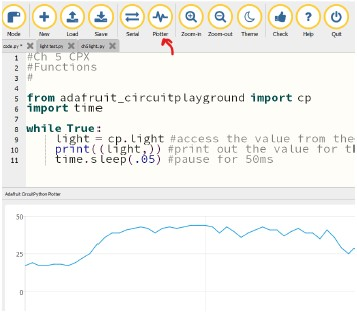

# CPX Measuring Light

### Introduction
This lab uses the built-in light sensor and translates it to a text output, plot and finally a pixel
output

## Procedure
### Part 1 - Characterization of the Light Sensor
-  The following code accesses the value from the light sensor  
  
-  Line 10 prints out the value as a tuple which the Mu Plotter can plot
-  Code this yourself and see the output from the ‘print’ statement by clicking on the Serial
button
-  Click on the Plotter button to see the output as a plot  
  
-  Use a bright light like the flashlight on your phone and shine it on your light sensor
-  Record the highest value with the light on: MAX ___________
-  Cover the sensor and note the lowest value should be zero

### Part 2 - Build the Functions
- Make a function to scale the light value to the index value
  - Use the following equation to calculate the index  
`𝑖𝑛𝑑𝑒𝑥 = 𝑖𝑛𝑡( 𝑙𝑖𝑔ℎ𝑡𝑉𝑎𝑙𝑢𝑒/𝑀𝐴𝑋 × 𝑚𝑎𝑥𝐼𝑛𝑑𝑒𝑥)`
  - The function should return the value in the ‘index’ variable
  - The function also have a parameter passed to it
  - Example:    
    
- Build another function which sets all pixels to black
  - Use a ‘for’ loop to loop through the 10 pixels
  - Set each pixel to (0, 0, 0)
  - This is a utility function which doesn’t need any parameters or return an values

### Part 3 - Finishing the Project
-  Modify the code in your main ‘while’ loop to make the light meter
-  Use the ‘scale’ function from Part 2 to return an index value to indicate the light level
-  Use this index to light a pixel
  - You may need to turn off all the pixels before you light this one!!! Just a small
hint
  - Make sure your pause very briefly to let things settle
  - Check out this [video](https://www.youtube.com/shorts/PSz1E3-uFn8) for an example

### Turn-in
-  Save your code to this repo and push
-  Upload a short video demonstrating the flashing lights (remote only)

### Grading
- Proper use of comments
- Coding of a ‘scale’ function
- Coding of a function to turn off the pixels
- Final working project
- Video demonstrating working project
